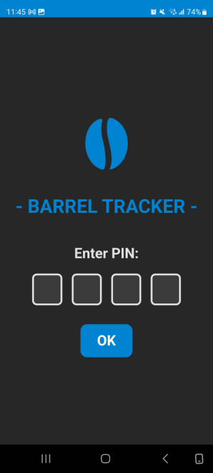

# Blaue Bohne Barrel Tracker

This is an ongoing freelance project built for a local small business [Blaue Bohne Rösterei](https://blauebohne.com/) - they were looking for a way to track their Pfand Barrels. Their system is to charge a deposit for each barrel when an order is sent out, but the delivery system they use will collect empty barrels as deliveries are made and store them until there are enough to fill a pallet, then they are all returned together. This means if there is damage to any of the barrels, unless the delivery driver makes a note of it, it is impossible to know who damaged the barrel and from whom to claim the deposit.

I used MERN stack technologies to create a Progressive Web App with a QR scanner. The client didn't want any complicated authentication, so I have implemented a simple PIN. On request, the token has a long lifespan - they didn't like having to enter the PIN too often. 

Each barrel is scanned before being sent out and the invoice and customer information are stored. Barrels are scanned again when they are returned. There is also an option to input the barrel number manually.

If there is any damage to the barrel, the employee can submit a "report". They can make notes and take pictures, and the report will be emailed to the business owner. If a barrel is deemed too damaged to stay in rotation, it can be marked as "damaged", and the client will be charged. If the damage is superficial, it can be marked as ok to continue using, but the history of the damage is stored for future reference. 

The current state of each barrel can be viewed from a list in the barrel management menu. Icons give an "at a glance" idea, and the barrel list item can be opened to view more details:

It is currently possible to edit the barrels, their open invoices, and any of their closed invoices directly through the barrel management menu. 

New barrels and customers can also be added through the management menus. My goal is to continue adding CMS features until there would be no need for the client to contact me directly to make changes in the database when something has been entered incorrectly or needs to be updated. I think I will also eventually need to separate the barrel histories into their own MongoDB collection, as they are currently saved in an array on the barrel document itself. This will make the app much more scalable as the business grows.